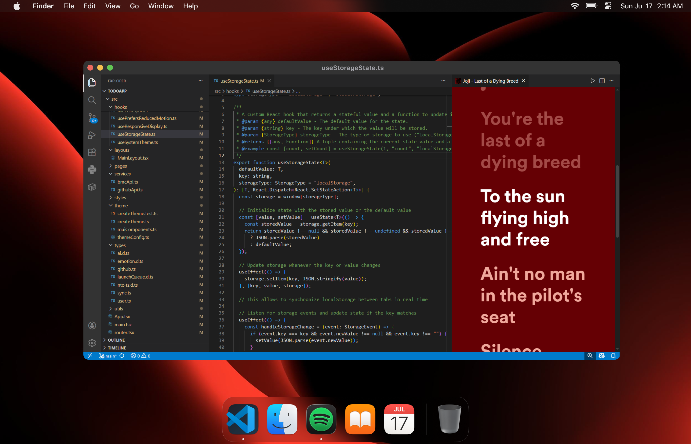

<div align="center">
  <br/>
  
  <p><i>See synchronized Spotify lyrics inside VS Code while coding.</i></p>
  <p>
    <a href="https://marketplace.visualstudio.com/items?itemName=therepanic.spotilyrics"></a>
    <a href="https://developer.spotify.com/documentation/web-api"></a>
    <a href="https://lrclib.net"></a>
    <a href="https://unlicense.org/"></a>
  </p>
</div>

---

## ✨ Features

- 📌 **Live lyrics sync** with your Spotify playback.
- 🎨 Lyrics colors auto-themed from album cover (via `colorthief`).
- 🖥️ Smooth **side panel view** – code on the left, lyrics on the right.
- 🔑 Simple **one-time login** using your own Spotify Client ID.
- 🚪 Quick logout command to reset session.
- ⚡ Set a **maximum tracks cache size** for lyrics syncing.
---

## 📸 Demo

## 

## ⚡️ Installation

1. Open **VS Code** → Extensions → search `spotilyrics` or [install from VS Code Marketplace](https://marketplace.visualstudio.com/items?itemName=therepanic.spotilyrics).

2. Run the command:

```
Show Spotify Lyrics via Spotilyrics
```

---

## 🔑 Authentication (one-time setup)

1. Go to [Spotify Developer Dashboard](https://developer.spotify.com/dashboard).
2. Create an app → copy **Client ID**.
3. **Important:** set the **Redirect URI** for your app to: `http://127.0.0.1:8000/callback`
4. Run the `Show Spotify Lyrics via Spotilyrics` command.
5. Paste your **Client ID** in the panel and log in.
6. Enjoy synced lyrics while coding! 🎶

> ℹ️ Why? – To respect Spotify API rate limits, you need your own ID.

---

## ⌨️ Commands

- `Show Spotify Lyrics via Spotilyrics` (`spotilyrics.lyrics`) – open synced lyrics panel.
- `Logout from Spotilyrics` (`spotilyrics.logout`) – clear session and re-auth when needed.
- `Set Tracks Cache Max Size` (`spotilyrics.setTracksCacheMaxSize`) – configure the maximum number of tracks cached for lyrics.

---

## ⚙️ Tech stack

- [Spotify Web API](https://developer.spotify.com/documentation/web-api/)
- [LRClib](https://lrclib.net/) for lyrics with timing
- [colorthief](https://lokeshdhakar.com/projects/color-thief/) for cover-based theme
- TypeScript + VS Code WebView

---

## 📜 License

This project is licensed as **Unlicensed**.  
Feel free to use, hack, and remix it – but no warranties 😉

---

<div align="center">
<sub>Made with ❤️ by therepanic. Code hard, vibe harder 🎧</sub>
</div>
